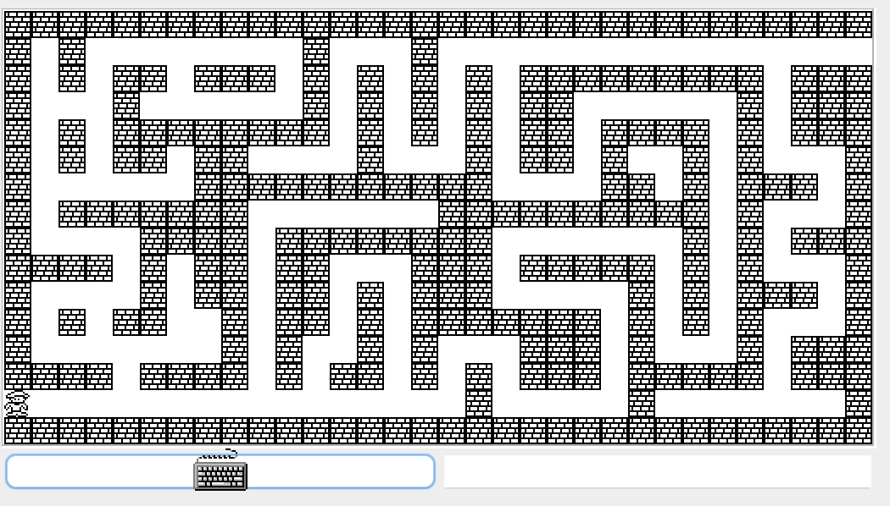

# Labyrinth - Nand2Tetris Project 9

## Overview

"Labyrinth" is a game developed as part of the Nand2Tetris course Project 9. The objective is to navigate the main character through a labyrinth from the bottom-left corner to the top-right corner using arrow keys. The game can be terminated at any point by pressing the "q" key.



## Table of Contents

- [Overview](#overview)
- [Installation](#installation)
- [Usage](#usage)

## Installation

1. Make sure you have Nand2Tetris tools installed on your machine.
2. Navigate to the `source` folder within `Labyrinth`.
3. Compile the source code using `JackCompiler`:

   On macOS:
    ```bash
    sh JackCompiler.sh /path/to/source/folder
    ```
   
    On Windows:
    ```bash
    JackCompiler.bat \path\to\source\folder
    ```

## Usage

1. Open `VirtualMachineEmulator` provided by Nand2Tetris tools.
2. Select the folder containing the compiled `.vm` files.
3. Run the game.

Controls:
- Up arrow: Move up
- Down arrow: Move down
- Left arrow: Move left
- Right arrow: Move right
- Q: Terminate the game
